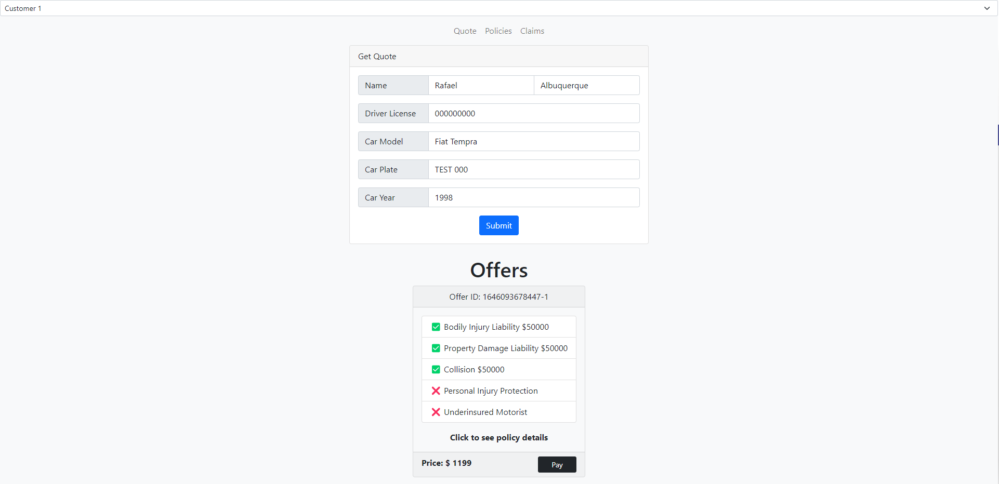

# Hyperledger Car Insurance


This project showcases the use of blockchain for insurance companies. Rasper Car Insurance network is a basic Hyperledger Fabric-based application to connect insurance companies, customers, and authorities in order to create, read and update insurance contracts and add and payout claims. 
This project aimed to set up a basic Hyperledger Fabric use case and test out Chaincode interactions.

## Authors

Name  | GitHub
------------- | ------------- 
Rafael Albuquerque | [@albuquerque-rafael](https://github.com/albuquerque-rafael) 
Kasper Pawlowski |  [@kasperpawlowski](https://github.com/kasperpawlowski)

Project Gantt Chart: https://docs.google.com/spreadsheets/d/1Azrs2l__uOtwhwyx1QeFw0hHLNr3ZQckCqy_ETUVKu8/

# Business Case
## Problem Statement
Using blockchain technology, insurance companies are able to solve a lot of problems that the car insurance world currently faces. As a start, insurers will be able to track policies and claims in an unprecedented way only by looking at a shared trusted ledger. 

For example, a car insurance company will be able to follow the driving history and behavior of an insured customer, and they will be able to adjust their policies accordingly. If the corresponding driver is reckless, he/she won’t be able to fraudulently claim eligibility for some premiums or bonuses.

The insurance info can be easily shared with designated authorities improving the transperancy and reducing the burocracy when requesting relevant information or processing claims.

The value of running this network using Hyperledger Fabric is that you can easily customize the network infrastructure as needed, whether that is the location of the nodes, the CPU and RAM of the hardware, the endorsement policy needed to reach consensus, or adding new organizations and members to the network.
<br />

## Goals
The project's goal is to simulate the life flow of a vehicle insurance policy in a simplified way.
The application enables the user to test its different functionalities using any profile. In this way, it is possible to submit quotes, select offers and pay, activate, suspend and expire policies, add claims, accept and pay claims.

## Stakeholders
The main stakeholders affected by this solution are the insurance companies, insurance customers and public authorities.

<br />

# Requirements
## Prerequisites
The following prerequisites are required to run a Docker-based Fabric network on your local machine.
```
# Update your Linux system
$ sudo apt-get update
$ sudo apt-get upgrade

# Install the latest version of git if it is not already installed.
$ sudo apt-get install git

# Install the latest version of cURL if it is not already installed.
$ sudo apt-get install curl

# Install Node JS and development tools
$ curl -sL https://deb.nodesource.com/setup_14.x | sudo -E bash -
$ sudo apt-get install -y nodejs
$ sudo apt install -y build-essential
```

## Setting up Docker & Docker Compose
```
# Install latest version of Docker if it is not already installed.
$ sudo apt update
$ sudo apt install -y apt-transport-https ca-certificates curl software-properties-common
$ curl -fsSL https://download.docker.com/linux/ubuntu/gpg | sudo apt-key add -
$ sudo add-apt-repository "deb [arch=amd64] https://download.docker.com/linux/ubuntu focal stable"
$ apt-cache policy docker-ce
$ sudo apt install -y docker-ce
$ sudo systemctl status docker

# Make sure the Docker daemon is running.
$ sudo systemctl start docker

# Optional: If you want the Docker daemon to start when the system starts, use the following:
$ sudo systemctl enable docker

# Install version 1.28.5 of Docker compose
$ sudo curl -L https://github.com/docker/compose/releases/download/1.28.5/docker-compose-`uname -s`-`uname -m` -o /usr/local/bin/docker-compose
$ sudo chmod +x /usr/local/bin/docker-compose

# Add your user to the Docker group.
$ sudo usermod -a -G docker <username>
```

## Featured Tech
- **Hyperledger Fabric** (https://www.hyperledger.org/use/fabric) is intended as a foundation for developing applications or solutions with a modular architecture. Its modular and versatile design satisfies a broad range of industry use cases.
- **Nodejs** (https://www.nodejs.org/) is an open-source, cross-platform JavaScript run-time environment that executes JavaScript code server-side.
- **Docker** (https://www.docker.com/) is a computer program that performs operating-system-level virtualization, also known as Containerization.

You can use your local docker containers or create a cloud account at IBM Cloud, Azure, AWS or Google Cloud Platform.


# Architecture
## Roles
Profile  | Actions
------------- | ------------- 
Insurance Manager | Activate, suspend and expire policies. 
Insurance Worker | Suspend and expire policies. 
Insurance Adjuster | Approve or decline claims.
Insurance Bookkeeper | Pay out claims.
Customer | Quote and select offers, add claims to active policies.
Authority | read all customers policies and claims.

<br />

## Functions
Profile  | Actions | Roles
------------- | ------------- | -------------
getOffers | Offchain process, ask for offers when quote is submmited. | All.  Customers can get only their polcies and claims
submitPolicy | Add selected offer to blockchain. | Customer
activatePolicy | Changes policy state to ACTIVE. | Insurance Manager
suspendPolicy | Changes policy state to SUSPENDED. | Insurance Manager and Worker
expirePolicy | Changes policy state to EXPIRED. | Insurance Manager and Worker
addClaim | Add claim to policy in the blockchain. | Customer
reviewClaim | Changes claim state to DECLINED or ACCEPTED. | Insurance Adjuster
payoutClaim | Changes claim state to PAID_OUT. | Insurance Bookkeeper
<br />

## State Diagram

<br />
<br />
<br />

## Complete Application Flowchart


<br />

## Data
Insurance data (policies and claims) is stored in a private collection. Only the insurance company personnel and authorities may have access to this data. The public world state contains only the hash of the policy and its state. 

Policy:
```json
// Policy
{
    "Timestamp": '',
    "PolicyNo": '',
    "ClientID": '',
    "InsuranceCompany": '',
    "StartDate": '',
    "EndDate": '',
    "MainDriver": {
        "FirstName": '', 
        "LastName": '', 
        "DriversLicenseNo": ''
    },
    "Car": {
        "Model": '',
        "Year": '',
        "LicensePlate": ''
    },
    "Coverage": {
        "BodilyInjuryLiability":    defaultCoverage,
        "PropertyDamageLiability":  defaultCoverage,
        "Collision":                defaultCoverage,
        "PersonalInjuryProtection": defaultCoverage,
        "UnderinsuredMotorist":     defaultCoverage
    },
    "Claims": [
        defaultClaim
    ],
    "State": '' 
}
}
```
Default Coverage:
```json
// defaultCoverage
{
  "Active": false,  
  "CoveredAmount": 0, 
  "ClaimedToDate": 0
}
```
Default Claim:
```json
// defaultClaim
{
  "Timestamp": '',  
  "PolicyNo": '',
  "ClaimNo": '',
  "Description": '', 
  "State": ''
}
```
<br />


## Deploy & Run Application
### Step 1. Clone this repository and setup PATH variable
```
git clone https://github.com/kasperpawlowski/Hyperledger-Car-Insurance.git
cd Hyperledger-Car-Insurance
export PATH=$(pwd)/bin:$PATH
```
### Step 2. Setup environment variables
- Rename ```.env.example``` file in the ```./backend``` directory to ```.env```
- Change the BACKEND_URL variable setting your public IP number. Leave the port as 5986.
### Step 3. Setup ports
Make sure that ports 5984-5896 are accessible and not blocked by the firewall.
- 5984 - couchDB database
- 5985 - frontend app
- 5986 - backend app
### Step 4. Install the dependencies
### Step 5. Start the Hyperledger network, deploy the chaincode and generate certificates for initial identities
### Step 6. Run Backend Server
To execute steps 4-6, in the root folder run the following command:
```
./setup.sh
```
### Step 7. Run User Interface app
In separate terminal, move to frontend folder and start the frontend locally:
```
cd Hyperledger-Car-Insurance/frontend/
npm start
```
### Step 8. Use the app
Open the browser using the address provided in the .env file and port 5985. i.e. http://104.198.73.130:5985/
### Stop network
To stop the network press `ctrl+c` in the terminal running backend server to stop it. Then run:
```
cd network
./network.sh down
```
<br />

## User Interface
Select user profile: 

With "Customer" profile selected, fill out the quote form:

After quote submission, different offers appear: 

Select one of the offers and click "pay":

In the Policies tab, Select "Insurance Manager" and activate the selected policy:

With "Customer" profile selected, click add claim: 

Fill the claim form with info about the incident:

"Insurance Worker" and "Insurance Manager" have access to expire or suspend the policy:

In the Claim tab, with "Insurance Adjuster" selected you can approve or decline the claim: 

To approve, fill the approved amounts:

If the claim was approved, select "Insurance Bookkeeper" profile and pay out the claim: 

The claim now appears with "Paid" status:

<br />


# Appendix
- Hyperledger Org: https://www.hyperledger.org/
- Hyperledger Intro: https://hyperledger-fabric.readthedocs.io/en/latest/whatis.html
- Hyperledger GitHub: https://github.com/hyperledger/fabric
- Hyperledger Wiki: https://wiki.hyperledger.org/display/fabric
- Using Private Data in Fabric: https://hyperledger-fabric.readthedocs.io/en/release-2.2/private_data_tutorial.html
- Writing your first Chaincode: https://hyperledger-fabric.readthedocs.io/en/release-2.2/chaincode4ade.html
- Private Data Collections on Hyperledger Fabric: https://github.com/IBM/private-data-collections-on-fabric
